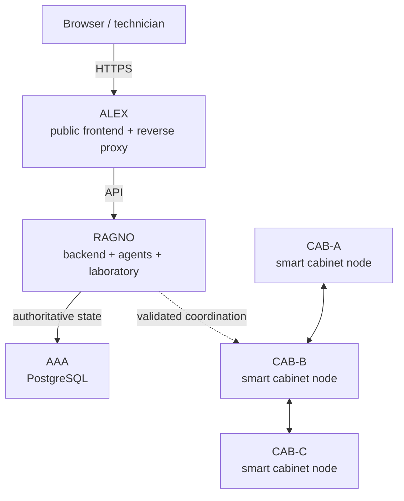
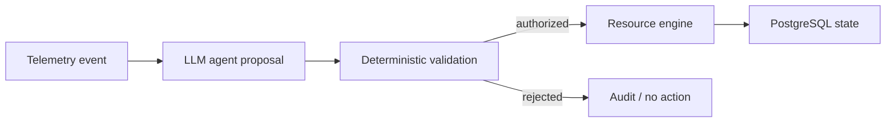

# FiberSpider architecture diagram

The LLM agent is advisory. It cannot reserve ports, change topology, provision an
ONT or update authoritative state directly. Only deterministic code performs an
allowed transition after technician authorization and evidence validation.

